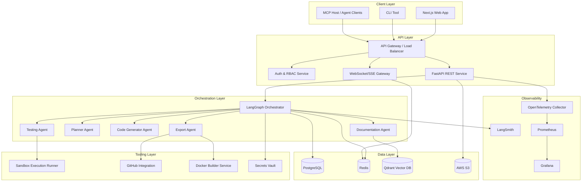
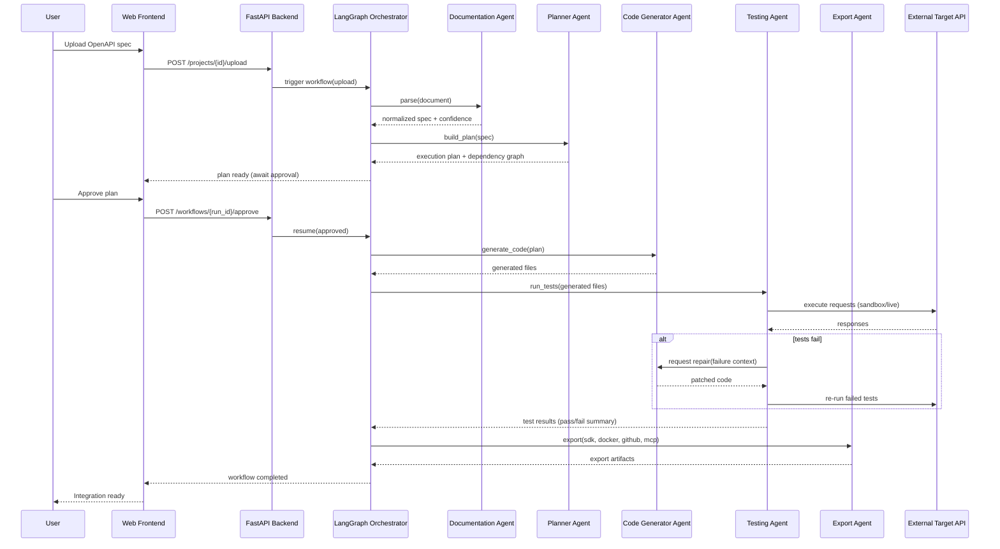
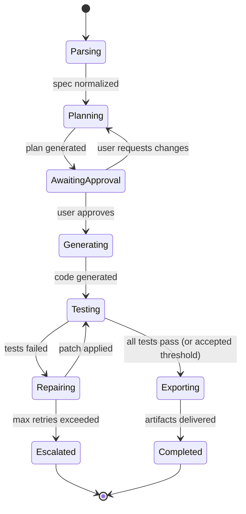
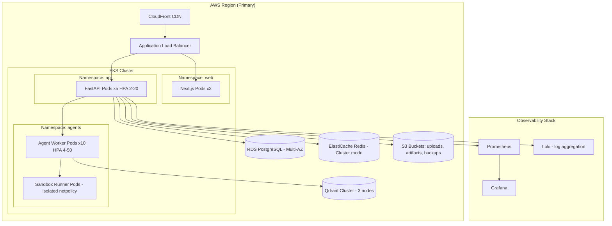

# Architecture Documentation
## APIWeaver — Enterprise System Architecture

---

## 1. System Diagram (ASCII)

```
                                   ┌───────────────────────────┐
                                   │         Users              │
                                   │ (Web, CLI, CI/CD, MCP host)│
                                   └─────────────┬──────────────┘
                                                 │ HTTPS
                                   ┌─────────────▼──────────────┐
                                   │   CDN / Edge (CloudFront)   │
                                   └─────────────┬──────────────┘
                                                 │
                                   ┌─────────────▼──────────────┐
                                   │  Load Balancer (ALB)        │
                                   └──────┬───────────────┬─────┘
                                          │               │
                              ┌───────────▼───┐   ┌───────▼──────────┐
                              │  Next.js Web   │   │  FastAPI Backend  │
                              │  (SSR + BFF)   │   │  (REST API)       │
                              └────────┬───────┘   └─────────┬────────┘
                                       │                     │
                                       │        ┌────────────▼────────────┐
                                       │        │   Auth / RBAC Service    │
                                       │        └────────────┬────────────┘
                                       │                     │
                                       │        ┌────────────▼────────────┐
                                       │        │  LangGraph Orchestrator  │
                                       │        │  (stateful workflow      │
                                       │        │   engine, checkpointed)  │
                                       │        └──┬──────┬──────┬───────┘
                                       │           │      │      │
                         ┌─────────────▼┐   ┌──────▼──┐┌──▼───┐┌─▼────────┐
                         │ Documentation │   │ Planner ││ Code ││ Testing  │
                         │    Agent      │   │  Agent  ││ Gen  ││  Agent   │
                         └───────┬───────┘   └────┬────┘│Agent │└────┬─────┘
                                 │                │     └───┬──┘     │
                                 │                │         │        │
                                 └────────┬───────┴────┬────┴────────┘
                                          │             │
                                ┌─────────▼──┐   ┌──────▼───────┐
                                │  Export     │   │  Tool Registry│
                                │   Agent     │   │ (sandbox exec,│
                                └──────┬──────┘   │  GitHub, S3,  │
                                       │           │  Docker API)  │
                                       │           └──────┬────────┘
                     ┌─────────────────┼──────────────────┼─────────────┐
                     │                 │                  │             │
              ┌──────▼─────┐   ┌───────▼──────┐   ┌───────▼──────┐  ┌───▼────────┐
              │ PostgreSQL │   │    Redis     │   │    Qdrant    │  │  AWS S3    │
              │ (system of │   │ (cache/queue/│   │ (vector DB)  │  │ (artifacts,│
              │  record)   │   │  pub-sub)    │   │              │  │  uploads)  │
              └────────────┘   └──────────────┘   └──────────────┘  └────────────┘

                     ┌──────────────────────────────────────────────┐
                     │        Monitoring & Observability Stack        │
                     │  LangSmith │ OpenTelemetry │ Prometheus │Grafana│
                     └──────────────────────────────────────────────┘

                     ┌──────────────────────────────────────────────┐
                     │      External Target APIs (user-integrated)   │
                     └──────────────────────────────────────────────┘
```

---

## 2. Component Diagram



---

## 3. Sequence Diagram — Full Integration Workflow



---

## 4. Agent Workflow (LangGraph State Machine)



---

## 5. Data Flow

1. **Ingestion:** Raw file → S3 (encrypted at rest) → Documentation Agent reads via presigned URL → normalized spec written to Postgres (`api_specs`, `endpoints`).
2. **Planning:** Planner Agent reads endpoints + dependency analysis → writes `endpoint_dependencies` → produces execution plan (in-memory, presented to user, persisted on approval).
3. **Generation:** Code Generator Agent streams generated files to S3, metadata to `generated_files`; live progress events published to Redis Streams → consumed by WebSocket gateway → pushed to frontend.
4. **Testing:** Testing Agent executes generated client code inside an isolated sandbox container with network egress limited to the target API's domain (allow-listed); results written to `test_results`.
5. **Repair loop:** Failing test context (request/response/stack trace) fed back into Code Generator Agent as a targeted repair prompt; bounded retry loop with each attempt logged to `repair_attempts`.
6. **Export:** Export Agent assembles final artifacts from S3-stored generated files; pushes to GitHub via OAuth app, builds Docker image via a dedicated builder service, and generates MCP manifest.
7. **Observability:** every agent step emits an OpenTelemetry span and a LangSmith trace; metrics aggregated into Prometheus and visualized in Grafana / the in-app Monitoring Dashboard.

---

## 6. Deployment Diagram



---

## 7. Scaling Strategy

| Component | Strategy |
|---|---|
| FastAPI pods | HPA on CPU + request latency, 2–20 replicas |
| Agent worker pods | HPA on Redis/Celery queue depth, 4–50 replicas (bursty workload) |
| Sandbox runners | Scaled independently, strict resource quotas (CPU/mem/time) per execution, isolated network policy |
| PostgreSQL | Vertical scaling + read replicas; partitioning for high-volume tables |
| Redis | Cluster mode with sharding beyond single-node capacity |
| Qdrant | Horizontal sharding across nodes as vector count grows |
| S3 | Inherently scalable; lifecycle policies move cold artifacts to Glacier |

---

## 8. Event Flow

- **Internal events** (agent step started/completed, test result, repair attempt) published to Redis Streams under per-workflow-run channels.
- **WebSocket/SSE Gateway** subscribes to relevant channels per connected client session and fans out to the frontend in real time.
- **Domain events** (workflow completed, export finished) also trigger optional webhooks to user-configured endpoints (Enterprise tier) and internal notification service (email/Slack).

---

## 9. Microservices Boundaries

| Service | Responsibility | Data Owned |
|---|---|---|
| `web-bff` (Next.js) | Server-rendering, session handling | none (stateless) |
| `api-service` (FastAPI) | REST API, auth, project CRUD | `projects`, `users`, `organizations` (via shared Postgres, service-owned tables) |
| `orchestrator-service` | LangGraph workflow execution | `workflow_runs`, `agent_events`, `workflow_checkpoints` |
| `sandbox-service` | Isolated code execution for testing | ephemeral, no persistent data |
| `export-service` | GitHub/Docker/MCP/SDK packaging | `exports`, `generated_files` refs |
| `metrics-service` | Aggregation for dashboards | `usage_metrics` (or Prometheus TSDB) |

> Services share one Postgres instance with schema-level ownership boundaries in v1 (pragmatic monolith-leaning approach); full database-per-service split is a documented future evolution once team/scale justifies the added operational overhead.

---

## 10. Failure Recovery

- **Workflow checkpointing:** every LangGraph node transition checkpointed to Postgres — a crashed orchestrator pod resumes from the last checkpoint rather than restarting the entire workflow.
- **Idempotent agent steps:** each agent step designed to be safely re-executed (e.g., code generation overwrites deterministically rather than appending).
- **Circuit breakers:** calls to external LLM providers wrapped with circuit breakers; on provider outage, orchestrator falls back to an alternate configured provider (multi-provider routing).
- **Dead-letter queue:** failed async jobs (Celery) routed to a DLQ for manual inspection rather than silently dropped.
- **Sandbox timeouts:** test execution bounded by hard timeouts; a hung sandbox is force-killed and recorded as a test failure, not a system outage.

---

## 11. Load Balancer

- AWS Application Load Balancer terminates TLS, routes `/api/*` to FastAPI target group, `/*` to Next.js target group, `/ws/*` to the WebSocket gateway target group (sticky sessions enabled for WS).
- Health checks per target group (`/healthz`) with automatic unhealthy-instance eviction.

---

## 12. Caching

See `Database.md §7` for full Redis caching key strategy. Architecturally, caching exists at three layers: CDN (static assets, landing page), application (Redis — parsed specs, dependency graphs), and database (Postgres query result caching via read replicas for dashboard aggregations).

---

## 13. Monitoring

Three pillars, per component:
- **Traces:** LangSmith (agent/LLM-specific) + OpenTelemetry (general request tracing), correlated via a shared `request_id`/`workflow_run_id`.
- **Metrics:** Prometheus scrapes `/metrics` from all services; Grafana dashboards for latency, error rate, saturation (RED/USE methodology).
- **Logs:** structured JSON logs shipped to Loki, queryable in-app via the Logs screen with secret redaction applied at emission time.

---

## 14. Message Queue

- **Celery + Redis broker** for async job dispatch (document parsing, code generation batches, export jobs).
- **Redis Streams** for lightweight real-time event fan-out (not a replacement for Celery — different purpose: pub/sub notification vs. durable task execution).
- Future evaluation: migrate high-throughput agent-event streaming to Kafka if event volume outgrows Redis Streams' operational ceiling.

---

## 15. Security Layers

See `Security.md` for full detail. Architecturally: edge (WAF on CloudFront/ALB) → network (VPC private subnets for data layer, security groups least-privilege) → application (JWT/RBAC, input validation) → data (encryption at rest/in transit, Vault-managed secrets) → execution (sandboxed, network-isolated test runners) → audit (immutable logs, full agent-action traceability).
