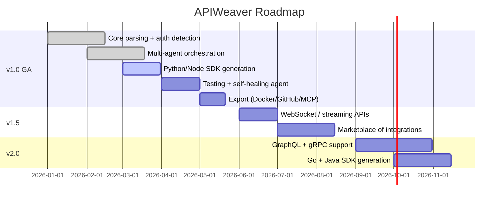

# Product Requirements Document (PRD)
## APIWeaver — Agent That Builds Integrations from API Docs Alone

**Document Owner:** Product Management
**Status:** Draft v1.0
**Last Updated:** 2026

---

## 1. Executive Summary

APIWeaver is an enterprise-grade Agentic AI platform that autonomously builds, tests, and exports production-ready API integrations directly from API documentation — OpenAPI specs, Swagger files, Postman collections, or free-form docs (Markdown/PDF/HTML). Instead of an engineer spending days reading docs, writing client code, handling auth, and debugging edge cases, APIWeaver's multi-agent system performs the entire workflow: parsing → planning → code generation → automated testing → self-healing → packaged export (SDK, Docker, GitHub repo, MCP tool).

APIWeaver targets engineering teams that repeatedly integrate third-party APIs (fintech, SaaS, e-commerce, internal platform teams) and want to compress integration timelines from days to minutes while maintaining production quality, security, and test coverage.

---

## 2. Vision

> "Any API, understood and integrated in the time it takes to read its documentation."

APIWeaver's long-term vision is to become the default agentic layer between "an API exists" and "an API is safely, reliably consumed in production" — eliminating the repetitive, error-prone labor of manual integration work while preserving (and improving on) the judgment a senior backend engineer would apply.

---

## 3. Problem Statement

| Problem | Impact |
|---|---|
| Reading and understanding large API docs is slow and error-prone | Engineers spend 2–5 days per non-trivial integration |
| Auth schemes (OAuth2, API keys, JWT, HMAC) are implemented inconsistently | Security bugs, broken token refresh flows |
| Pagination, rate limiting, and retries are frequently mishandled | Production outages, data loss, throttling bans |
| No automatic validation that generated code actually works against the live API | Bugs surface in production instead of at build time |
| Generated integrations are one-off, not reusable, versioned, or packaged | Duplicated work across teams; no institutional reuse |
| Growing use of LLM agents/tools (MCP) requires manually wrapping APIs as tools | Slows down agentic application development |

---

## 4. Target Users

| Persona | Description |
|---|---|
| Backend/Platform Engineers | Integrate 3rd-party APIs into internal services regularly |
| Startup Engineering Teams | Need to move fast with limited integration bandwidth |
| AI/Agent Developers | Need APIs wrapped as MCP-compatible tools for agentic systems |
| Integration/Automation Consultancies | Build client integrations at scale for multiple customers |
| DevRel / SDK Teams | Maintain SDKs across languages for their own public APIs |

---

## 5. Business Goals

1. Reduce average integration time from days to under 30 minutes for standard REST APIs.
2. Achieve >90% automatic test pass rate on generated integrations without human intervention.
3. Become the standard tool for converting REST APIs into MCP tools for agentic ecosystems.
4. Drive adoption through open-source core + enterprise SaaS tier (self-hosted vs managed).
5. Establish a marketplace of pre-built, community-verified integrations.

---

## 6. User Personas

### Persona 1 — "Maya, Backend Engineer"
- Works at a mid-size fintech, integrates 2–3 new payment/KYC APIs per quarter.
- Pain: OAuth2 + webhook signature verification always takes longest.
- Goal: Get a working, tested Python client in under an hour.

### Persona 2 — "Dev, AI Agent Builder"
- Builds internal LLM agents that need tool access to internal and external APIs.
- Pain: Manually wrapping every endpoint as an MCP tool is tedious.
- Goal: Upload OpenAPI spec → get MCP tool server instantly.

### Persona 3 — "Priya, Engineering Manager"
- Oversees a platform team responsible for 40+ third-party integrations.
- Pain: Lack of standardization; every integration looks different, hard to audit.
- Goal: Standardized, versioned, auditable integration artifacts across the org.

---

## 7. User Stories

| ID | As a... | I want to... | So that... |
|---|---|---|---|
| US-01 | Backend engineer | Upload an OpenAPI YAML file | The agent can understand the API automatically |
| US-02 | Backend engineer | See a generated execution plan before code is written | I can review and approve the integration approach |
| US-03 | AI agent builder | Export the integration as an MCP tool server | My agents can call the API directly |
| US-04 | Engineer | Have the agent auto-test every endpoint | I trust the generated code works |
| US-05 | Engineer | See failed tests auto-fixed by the agent | I don't have to debug generated code manually |
| US-06 | Engineering manager | View execution history and versioning | I can audit what changed and when |
| US-07 | Engineer | Export a ready-to-run Docker container | I can deploy the integration immediately |
| US-08 | Engineer | Push the generated project to GitHub | It becomes part of our normal SDLC |
| US-09 | Security engineer | Review how secrets/auth are handled before deployment | I can approve it for production use |
| US-10 | Engineer | Regenerate only the Node.js SDK from an existing project | I don't want to redo the whole pipeline for a new language |

---

## 8. Success Metrics

| Metric | Target |
|---|---|
| Time from upload to working integration | < 30 min (P50), < 2 hr (P95) |
| Automated endpoint test pass rate | > 90% without manual fixes |
| Self-healing success rate (auto-fixed failures) | > 75% of initially failing tests |
| SDK generation accuracy (compiles/runs without edits) | > 95% |
| User-reported production incidents from generated code | < 1 per 50 integrations/month |
| Weekly Active Projects (WAP) | 500 in 6 months post-GA |

---

## 9. Scope

**In Scope (v1.0):**
- OpenAPI 3.x / Swagger 2.0 / Postman Collection v2.1 ingestion
- Freeform doc ingestion (Markdown/PDF/HTML) via LLM extraction
- Python (FastAPI client + requests/httpx SDK) and Node.js (TypeScript SDK) generation
- Auth detection: API Key, Bearer/JWT, OAuth2 (Client Credentials, Auth Code), Basic Auth, HMAC signing
- Automated endpoint testing against sandbox/live credentials
- Self-healing code repair loop (bounded retries)
- Export: SDK zip, Docker image, GitHub repo, MCP tool manifest + server
- Project workspace with versioning and execution history
- Monitoring dashboard (test pass rate, run history, token usage)

**Explicitly supported protocols:** REST/HTTP(S), JSON. Webhooks (inbound) supported for verification/signature checks.

---

## 10. Out of Scope (v1.0)

- GraphQL and gRPC API support (planned v2.0)
- SOAP/XML-RPC APIs
- Non-English documentation parsing
- Fully autonomous production deployment without human approval gate
- Languages beyond Python and Node.js (Go, Java planned v2.0)
- Real-time bi-directional streaming API integrations (WebSocket support planned v1.5)

---

## 11. Functional Requirements

| ID | Requirement |
|---|---|
| FR-1 | System shall parse OpenAPI/Swagger/Postman files and extract endpoints, schemas, and auth requirements |
| FR-2 | System shall use an LLM-based extraction pipeline for unstructured docs (PDF/HTML/Markdown) |
| FR-3 | System shall detect authentication scheme automatically with >95% accuracy on standard schemes |
| FR-4 | System shall build a dependency graph representing endpoint call order (e.g., auth → list → detail) |
| FR-5 | System shall generate an execution plan reviewable by the user before code generation |
| FR-6 | System shall generate idiomatic Python and Node.js client code |
| FR-7 | System shall generate automated tests for every discovered endpoint |
| FR-8 | System shall execute tests against sandbox/live environment using user-provided credentials |
| FR-9 | System shall attempt automatic repair of failing generated code up to N retries |
| FR-10 | System shall export packaged artifacts: SDK, Docker image, GitHub repo, MCP tool |
| FR-11 | System shall persist full execution history with timestamps, diffs, and versions |
| FR-12 | System shall expose a REST API and web dashboard for all operations |

---

## 12. Non-Functional Requirements

| Category | Requirement |
|---|---|
| Performance | P95 end-to-end generation time < 2 hours for APIs with ≤150 endpoints |
| Scalability | Support 1,000+ concurrent agent workflows via horizontal worker scaling |
| Reliability | 99.5% uptime for managed SaaS tier |
| Security | Secrets never persisted in plaintext; encrypted at rest (AES-256) and in transit (TLS 1.3) |
| Observability | Every agent step traced (LangSmith/OpenTelemetry) |
| Portability | Self-hostable via Docker Compose or Helm chart |
| Auditability | Immutable execution logs retained per configurable policy |
| Cost Control | Per-project token budget with hard cutoffs |

---

## 13. Constraints

- LLM providers (OpenAI, Anthropic, local Llama) have rate limits and cost implications — must support pluggable model routing.
- Testing against live third-party APIs may incur real usage/cost on the target API — sandbox mode is default.
- Generated code must not execute with unrestricted network/file access — sandboxed execution required.
- Cannot guarantee 100% correctness for ambiguous or poorly written documentation.

---

## 14. Acceptance Criteria

- A user can upload a valid OpenAPI 3.0 spec and receive a working, tested Python SDK within the target time SLA.
- Generated code passes lint/type-check with zero errors.
- At least 90% of endpoints have passing auto-generated tests without manual intervention on a well-formed spec.
- MCP tool export is directly loadable by a standard MCP client without modification.
- All agent actions are visible in the execution history with rollback capability.

---

## 15. Roadmap

---

## 16. Future Scope

- Integration marketplace with community-verified connectors.
- Auto-generated changelogs when a target API's spec changes (spec-diffing agent).
- Multi-modal doc ingestion (video walkthroughs, Slack threads).
- Fine-tuned smaller models for cost-efficient code generation at scale.
- Autonomous "integration health monitor" agent that re-tests production integrations on a schedule.

---

## 17. KPIs

| KPI | Definition | Target (6mo) |
|---|---|---|
| Time-to-Integration (TTI) | Median time from upload to exported artifact | < 30 min |
| Auto-Fix Rate | % of failing tests resolved without human input | > 75% |
| Adoption | Monthly active organizations | 200 |
| Retention | 90-day org retention | > 60% |
| NPS | User satisfaction | > 40 |
| Cost per Integration | Avg. LLM token spend per completed project | < $2.50 |
