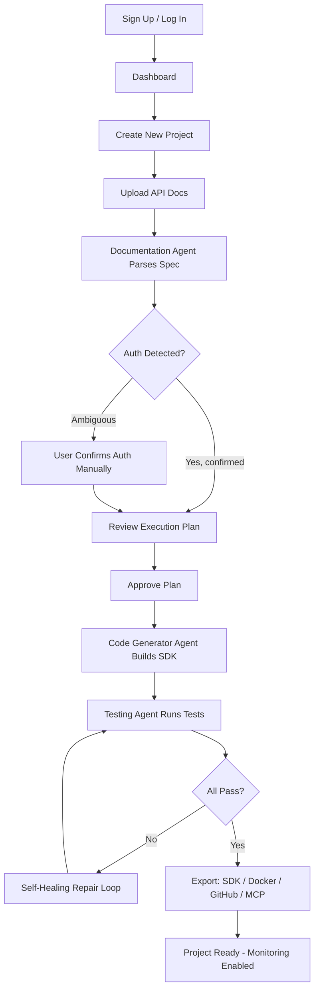

# UI/UX Documentation
## APIWeaver — Design System & Screen Specifications

---

## 1. Design System

### 1.1 Design Principles
- **Clarity over cleverness** — agent state and progress must always be legible; users should never wonder "what is it doing right now."
- **Trust through transparency** — every AI action is inspectable (plan before execution, diffs before overwrite, logs always available).
- **Progressive disclosure** — dashboards show summaries by default; details available on demand (drill-down, not clutter).
- **Consistent density** — data-heavy screens (logs, tests) use compact tables; decision screens (plan approval) use generous spacing.

### 1.2 Colors

| Token | Light Mode | Dark Mode | Usage |
|---|---|---|---|
| `--color-bg-primary` | `#FFFFFF` | `#0B0D12` | Page background |
| `--color-bg-secondary` | `#F6F7F9` | `#12151C` | Cards, panels |
| `--color-bg-tertiary` | `#EDEFF3` | `#1B1F29` | Nested panels, code blocks |
| `--color-border` | `#E2E4E9` | `#242833` | Dividers, card borders |
| `--color-text-primary` | `#12151C` | `#F2F3F5` | Headings, body text |
| `--color-text-secondary` | `#5B6270` | `#9AA1AE` | Captions, metadata |
| `--color-brand-primary` | `#5B4CFF` | `#7C6FFF` | Primary actions, links |
| `--color-brand-accent` | `#00C2A8` | `#00E6C9` | Agent/AI accents, highlights |
| `--color-success` | `#1FAA59` | `#3DD873` | Passing tests, success states |
| `--color-warning` | `#D98A1E` | `#F5A93F` | Retry/degraded states |
| `--color-error` | `#DC3545` | `#FF5C6C` | Failures, destructive actions |
| `--color-info` | `#2E7DD1` | `#5FA8FF` | Informational badges |

### 1.3 Typography

| Role | Font | Size | Weight | Line Height |
|---|---|---|---|---|
| Display | Inter | 32px | 700 | 1.2 |
| H1 | Inter | 24px | 700 | 1.3 |
| H2 | Inter | 20px | 600 | 1.35 |
| H3 | Inter | 16px | 600 | 1.4 |
| Body | Inter | 14px | 400 | 1.6 |
| Caption | Inter | 12px | 400 | 1.5 |
| Code / Mono | JetBrains Mono | 13px | 400 | 1.6 |

### 1.4 Spacing Scale

`4px, 8px, 12px, 16px, 24px, 32px, 48px, 64px` — Tailwind default scale (`1`–`16`) mapped 1:1; all component padding/margins use these tokens exclusively (no arbitrary values).

### 1.5 Components (shadcn/ui based)

| Component | Notes |
|---|---|
| `Button` | primary / secondary / ghost / destructive variants; loading state with spinner replacing label |
| `Card` | used for project tiles, agent status, metric summaries |
| `Table` | sticky header, row hover, sortable columns, virtualized for >200 rows |
| `Badge` | status pills (pass/fail/pending/running) using semantic colors |
| `Tabs` | screen-level navigation (e.g., Project → Overview/Endpoints/Tests/Logs) |
| `Dialog/Modal` | approval gates, export wizard |
| `Toast` | non-blocking notifications (generation complete, test failed) |
| `CodeBlock` (Monaco-based) | syntax highlighted, read-only diff mode for repairs |
| `Timeline` | execution history, self-healing steps |
| `ProgressStepper` | multi-agent workflow visualization |
| `Tooltip` | inline help on technical terms (e.g., "dependency graph") |

### 1.6 Responsive Design

| Breakpoint | Width | Layout Behavior |
|---|---|---|
| `sm` | < 640px | Single column, bottom nav, tables collapse to cards |
| `md` | 640–1024px | Collapsible sidebar, 2-column dashboards |
| `lg` | 1024–1440px | Full sidebar, 2–3 column dashboards |
| `xl` | > 1440px | Max-width 1440px content, extra whitespace gutters |

### 1.7 Dark Mode

- Default: follows OS preference (`prefers-color-scheme`), user-overridable and persisted per-user.
- All semantic color tokens defined as CSS variables (see §1.2) — no hardcoded hex in components.
- Code editor (Monaco) theme switches with app theme (`vs` / `vs-dark`).
- Charts (Recharts) use theme-aware palettes to preserve contrast in both modes.

### 1.8 Navigation

```
┌─────────────────────────────────────────────┐
│ Logo   Projects   Docs   Marketplace   ⚙ 👤 │  ← Top bar (global)
├───────────┬─────────────────────────────────┤
│  Sidebar  │        Main Content Area         │
│  Overview │                                  │
│  Upload   │                                  │
│  Plan     │                                  │
│  Build    │                                  │
│  Test     │                                  │
│  Export   │                                  │
│  Logs     │                                  │
│  History  │                                  │
│  Settings │                                  │
└───────────┴─────────────────────────────────┘
```
- Top bar: global (org switcher, marketplace, notifications, account).
- Left sidebar: project-scoped navigation, reflects pipeline stage order.
- Breadcrumbs on all sub-pages: `Org / Project / Section`.

---

## 2. Screens

### 2.1 Landing Page
**Purpose:** Marketing/entry point converting visitors to sign-up.
**Sections:** Hero (headline + animated demo of doc → SDK), feature grid, "How it works" 4-step visual, supported formats logos, testimonials, pricing teaser, footer.
**States:** N/A (static, no auth-gated content).

### 2.2 Dashboard
**Purpose:** Org-level overview after login.
**Components:** Project grid/list toggle, "New Project" CTA, recent activity feed, usage summary card (tokens, active workflows), quick-start templates.
**Empty State:** Illustration + "Create your first project" CTA when no projects exist.

### 2.3 Projects (List)
**Purpose:** Browse/manage all projects.
**Components:** Filterable/sortable table (name, status, last updated, owner), search bar, bulk actions (archive), status badges (Draft / Planning / Building / Testing / Ready / Failed).

### 2.4 Upload
**Purpose:** Create new project by uploading docs.
**Components:** `UploadDropzone` (drag-drop + file picker + paste-URL tab), format auto-detection badge, multi-file list, "Continue to Parsing" CTA.
**Loading State:** Skeleton parsing animation with agent avatar + streaming status text ("Detecting authentication scheme…").
**Error State:** Inline error card with specific parse error and "Try a different file" action.

### 2.5 Integration Builder (Plan + Build)
**Purpose:** Core workspace — review execution plan, endpoint list, dependency graph, and trigger/monitor code generation.
**Components:** `ProgressStepper` (Plan → Generate → Test → Export), `DependencyGraphView` (interactive), `EndpointTable` with per-endpoint status, `PlanApprovalModal` before generation starts, live `AgentStatusCard` feed during generation, `CodePreviewEditor` split pane (file tree + Monaco viewer).

### 2.6 Testing
**Purpose:** View and control automated test execution.
**Components:** `TestRunPanel` (run/re-run controls, environment selector: sandbox/live), `EndpointTestResultRow` list with expandable request/response detail, `SelfHealingTimeline` showing repair attempts inline under failed tests, `TestCoverageChart` (donut: pass/fail/pending).

### 2.7 Logs
**Purpose:** Deep-dive debugging and audit.
**Components:** `LogViewer` (virtualized, streaming), `LogFilterBar` (by agent, level, time range, endpoint), search, export-to-file action, secret-redaction indicator badge.

### 2.8 Settings
**Purpose:** Project and org configuration.
**Sub-tabs:** General (name, description), Auth & Secrets (credential management, Vault status), Retry Policy, Team & Permissions, Billing/Usage limits, Danger Zone (archive/delete).

### 2.9 Monitoring
**Purpose:** Operational dashboard across projects/org.
**Components:** `MetricsDashboard` (workflow success rate, avg TTI, token spend trend), `AgentHealthPanel` (per-agent latency/error rate), `CostUsageChart`, alert configuration panel.

### 2.10 History
**Purpose:** Full audit trail of versions and runs.
**Components:** `HistoryTimeline` (chronological), `RunComparisonView` (side-by-side diff of two versions), rollback confirmation dialog.

### 2.11 Error Screens
- **404** — friendly illustration, "This project doesn't exist or you don't have access," link back to dashboard.
- **500 / Agent Failure** — clear distinction between "platform error" (our fault, retry available) vs. "target API error" (their API returned an error, shown with raw response).
- **Auth/Permission Denied** — explains required role, link to request access.

### 2.12 Loading Screens
- Skeleton loaders matching final layout shape (never generic spinners for content areas).
- Agent-driven loading states show a short rotating status line reflecting actual current step (sourced from workflow event stream), not fake progress.

### 2.13 Empty States
- No projects yet, no test runs yet, no logs yet, no export history yet — each with a one-line explanation and a primary CTA relevant to that screen (never a dead end).

---

## 3. Accessibility

- WCAG 2.1 AA compliance target across all screens.
- Full keyboard navigation; visible focus rings using `--color-brand-primary` outline.
- Color is never the sole indicator of state — status badges pair color with icon + text label (e.g., ✓ Passed, not just green).
- Minimum contrast ratio 4.5:1 for body text, 3:1 for large text, verified per theme.
- All interactive elements have accessible names (`aria-label`) especially icon-only buttons.
- Live regions (`aria-live="polite"`) for streaming agent status updates so screen readers announce progress.
- Reduced-motion setting respected (`prefers-reduced-motion`) — disables non-essential animation.

---

## 4. Animations

| Interaction | Animation |
|---|---|
| Agent status transitions | Cross-fade + subtle scale (150ms ease-out) |
| New log line arrival | Slide-in from bottom, fade (120ms) |
| Test result pass/fail | Badge pulse once on state change |
| Progress stepper advance | Fill animation along connector line (300ms ease-in-out) |
| Modal open/close | Scale 0.96→1 + fade (200ms) |
| Toast notifications | Slide-in from top-right, auto-dismiss 4s, pause on hover |

All animations respect `prefers-reduced-motion: reduce` by disabling transform/scale and falling back to opacity-only or instant transitions.

---

## 5. User Flow



---

## 6. Wireframe Descriptions

**Integration Builder — Build Stage (desktop, 1440px):**
- Left: collapsible file-tree sidebar (240px) listing generated files by language target.
- Center: Monaco code viewer (flex-grow), tabbed by open file, read-only during generation with a subtle "AI writing…" cursor animation on actively-generated files.
- Right: 320px `AgentStatusCard` rail — current agent, current file being written, tokens used, elapsed time, cancel button.
- Bottom: persistent thin status bar — overall progress %, endpoints completed / total.

**Testing Screen (desktop):**
- Top: environment toggle (Sandbox/Live) + "Run All Tests" primary button + last-run timestamp.
- Left 60%: `EndpointTestResultRow` list, each row expandable to show request/response JSON, latency, and (if failed) an inline `SelfHealingTimeline`.
- Right 40%: `TestCoverageChart` donut + summary stats (pass/fail/skipped counts) sticky on scroll.

**Mobile (< 640px) adaptations:** Sidebar becomes a bottom sheet triggered by a floating action button; tables become stacked cards with key fields only (status, name, timestamp) and a "view details" tap target.
