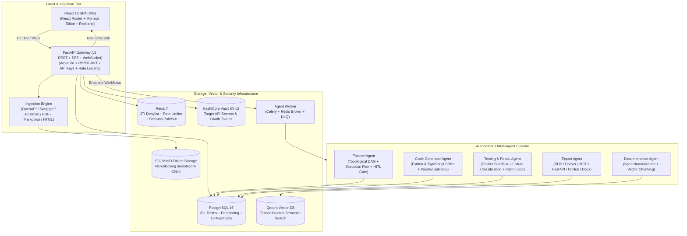

# APIWeaver

<div align="center">

**Autonomous Multi-Agent API Integration Platform**

[](https://github.com/AJambla/APIWeaver-Autonomous-Multi-Agent-API-Integration-Platform/actions/workflows/ci.yml)
[](https://www.python.org/)
[](https://fastapi.tiangolo.com/)
[](https://react.dev/)
[](https://www.docker.com/)
[](LICENSE)

*Ingests raw API specifications and unstructured documentation, computes topological dependency graphs, generates typed client code, executes sandboxed validation with iterative self-healing repairs, and exports production-ready SDKs, servers, Docker containers, and MCP tool servers.*

[About](#about-apiweaver) • [Architecture](#platform-architecture) • [Key Capabilities](#key-capabilities) • [Quick Start](#quick-start) • [Deployment](#deployment-options) • [Testing](#automated-testing--quality-gates) • [Contributing](CONTRIBUTING.md) • [Security](SECURITY.md)

</div>

---

## About APIWeaver

Modern software integrations frequently stall on ambiguous, incomplete, or fragmented API documentation. **APIWeaver** transforms this lifecycle from a manual, error-prone engineering chore into an autonomous, verified pipeline:

1. **Ingest Heterogeneous Documentation:** Ingests standardized schemas (OpenAPI 3.x, Swagger 2.0, Postman Collections) as well as unstructured documents (PDFs, Markdown, HTML guides).
2. **Topological Dependency Resolution:** Derives parameter lineages, stateful prerequisites (e.g. `POST /auth/token` precedes `GET /accounts`), and flags destructive endpoints for human review.
3. **Autonomous Code Generation:** Produces idiomatic, strongly-typed client libraries in Python and TypeScript/Node.js using modular templates.
4. **Sandboxed Validation & Self-Healing:** Executes real syntax and integration test suites in isolated Docker sandboxes. When failures occur, an LLM-driven classifier pinpoints the fault and iteratively repairs code in up to 3 self-healing loops.
5. **Multi-Target Distribution:** Packages and exports directly to Python SDKs, npm packages, standalone single-file clients, production FastAPI proxy routers, Docker containers, Model Context Protocol (MCP) tool servers, GitHub repositories, and automated CI/CD workflows.

---

## Platform Architecture

APIWeaver operates as an event-driven, multi-agent state machine backed by persistent storage, vector retrieval, and isolated execution engines:



---

## Key Capabilities

### 🔍 Unified Multi-Format Documentation Ingestion
- Deterministic normalizers parse structured OpenAPI 3.0/3.1, Swagger 2.0, and Postman v2.1 specifications into a canonical schema.
- Built-in unstructured document parser extracts endpoints and request shapes from freeform PDFs, HTML pages, and Markdown files.
- Qdrant-backed vector RAG provides semantic similarity search with tenant payload filtering.

### 🗺️ Topological Dependency Graph & Human-in-the-Loop Review
- Automatically constructs Directed Acyclic Graphs (DAGs) representing entity lifecycles.
- Identifies prerequisite chains (e.g. creating a parent organization before querying child accounts).
- Flags destructive operations (`DELETE`, batch modifications) and halts execution for Human-in-the-Loop (HITL) review and one-click cryptographic approval.

### ⚡ Parallel SDK Generation
- Generates fully-typed client code in **Python** (Pydantic models, HTTPX async clients) and **TypeScript/Node.js** (Fetch/Axios, strict type definitions).
- Independent endpoint sub-graphs are generated in parallel using asynchronous batch execution.

### 🛡️ Docker Sandbox Execution & Self-Healing Repair
- LLM-authored client modules are executed inside sandboxed, unprivileged Docker containers (`nobody:nobody`) with strict memory, CPU, PID, and timeout bounds.
- Automated failure classifier categorizes errors across 8 distinct taxonomies (auth errors, schema mismatches, rate limits, network timeouts, etc.).
- Triggers up to 3 iterative self-healing repair attempts, synthesizing targeted code patches and verifying resolution before completion.

### 📦 8 Multi-Target Export Formats
1. **SDK Package:** Wheel and npm package configurations ready for distribution (`pyproject.toml`, `package.json`).
2. **Standalone Client:** Flattened single-file clients (`client.py`, `client.ts`).
3. **FastAPI Proxy Server:** Ready-to-run backend router implementing target-API integrations with dependency injection.
4. **Docker Container:** Multi-stage container builds with health probes and unprivileged runtimes.
5. **Model Context Protocol (MCP):** Generates Anthropic-compatible MCP tool servers with JSON schema validation.
6. **GitHub Repository:** Automatically commits and pushes files to a designated repository using GitHub Apps and OAuth.
7. **Interactive Documentation:** Static and interactive Markdown and OpenAPI 3.1 documentation.
8. **CI/CD Workflows:** Automated GitHub Actions workflows for continuous SDK building and testing.

### 🔒 Enterprise-Grade Security & Multi-Tenancy
- **Authentication:** Argon2id password hashing, RS256 JWT access tokens, rotating refresh token families, and SHA-256 hashed API keys.
- **Secret Isolation:** Target API credentials and OAuth tokens are written directly to HashiCorp Vault KV v2; tokens are completely purged upon connection revocation.
- **Path Traversal Protection:** All storage keys and Vault paths are validated against directory traversal attacks (`..`).
- **Audit Logging:** Append-only database-level immutable audit logging (`audit_logs`).
- **Security Headers:** HTTP response headers enforce `X-Content-Type-Options: nosniff`, `X-Frame-Options: DENY`, `Referrer-Policy: strict-origin-when-cross-origin`, and `Permissions-Policy`.

---

## Quick Start

### Option 1: Turnkey Docker Compose (Recommended)

Run the full production stack—PostgreSQL, Redis, Qdrant, MinIO, Vault, FastAPI Backend, Celery Worker, and React Web Dashboard—with a single command:

```bash
# 1. Clone repository
git clone https://github.com/AJambla/APIWeaver-Autonomous-Multi-Agent-API-Integration-Platform.git
cd APIWeaver

# 2. Configure environment
cp .env.example .env

# 3. Boot all services
docker compose -f infra/docker/docker-compose.single-node.yml --profile docker-ui up -d --build
```

#### Service Endpoints

| Service | Endpoint | Description |
| :--- | :--- | :--- |
| **Web Dashboard** | [http://localhost:3000](http://localhost:3000) | React 18 integration and monitoring UI |
| **FastAPI Swagger Docs** | [http://localhost:8000/api/v1/docs](http://localhost:8000/api/v1/docs) | Interactive OpenAPI documentation |
| **Liveness & Readiness Probes** | [http://localhost:8000/healthz](http://localhost:8000/healthz) | Health probes for load balancers |
| **MinIO Console** | [http://localhost:9001](http://localhost:9001) | S3 storage UI (`minioadmin` / `minioadmin`) |
| **Qdrant Vector Dashboard** | [http://localhost:6333/dashboard](http://localhost:6333/dashboard) | Vector collection explorer |
| **HashiCorp Vault** | [http://localhost:8200](http://localhost:8200) | Secrets management server |

To inspect logs or tear down:
```bash
docker compose -f infra/docker/docker-compose.single-node.yml logs -f
docker compose -f infra/docker/docker-compose.single-node.yml down
```

---

### Option 2: Local Development Mode

For active development with hot-reloading:

#### 1. Prerequisites
- **Python 3.12+** & **Poetry**
- **Node.js 20+** & **npm**
- **Docker** (for supporting databases)

#### 2. Start Data Stores
```bash
docker compose -f infra/docker/docker-compose.dev.yml up -d
```

#### 3. Setup Backend
```bash
cd backend
poetry install --with dev
poetry run alembic upgrade head
poetry run uvicorn app.main:app --reload --port 8000
```

#### 4. Setup Celery Worker (In a separate terminal)
```bash
cd backend
poetry run celery -A agent_worker.celery_app worker --loglevel=info --concurrency=4
```

#### 5. Setup Frontend (In a separate terminal)
```bash
cd frontend
npm ci --legacy-peer-deps
npm run dev
```

Visit [http://localhost:3000](http://localhost:3000) to access the application.

---

## Deployment Options

APIWeaver supports modular deployment architectures:

1. **Self-Hosted Single-Node:** Configured via [`infra/docker/docker-compose.single-node.yml`](infra/docker/docker-compose.single-node.yml) for standalone deployment on EC2, GCP Compute Engine, or bare-metal servers.
2. **Cloud Infrastructure (AWS Terraform):** Production Terraform modules located in [`infra/terraform/`](infra/terraform/) provision:
   - Isolated VPC across multiple availability zones.
   - Amazon RDS PostgreSQL (multi-AZ with automated backups).
   - Amazon ElastiCache Redis cluster.
   - Amazon S3 storage buckets with KMS encryption.
   - Application Load Balancers (ALB) and Route53 DNS management.

---

## Automated Testing & Quality Gates

The codebase maintains **100% hermetic test coverage** across both backend and frontend layers:

```bash
# Backend Quality Checks (316 Tests, 0 Failures)
cd backend
poetry run ruff check .          # Strict linting verification
poetry run pytest -v             # Complete unit, integration, and security suites

# Frontend Quality Checks (19 Tests, 0 Failures)
cd frontend
npm run lint                    # ESLint with 0 warnings
npm test                        # Vitest unit and UI component suites
npm run build                   # Production Vite bundle compilation
```

---

## Configuration Reference

Configuration is managed via environment variables (see [`.env.example`](.env.example) for defaults):

| Variable | Default | Purpose |
| :--- | :--- | :--- |
| `DATABASE_URL` | `postgresql+asyncpg://...` | Async PostgreSQL database connection URL |
| `REDIS_URL` | `redis://localhost:6379/0` | Redis connection URL for rate limits and streams |
| `QDRANT_URL` | `http://localhost:6333` | Qdrant vector database endpoint |
| `S3_ENDPOINT_URL` | `http://localhost:9000` | S3 / MinIO object storage endpoint |
| `VAULT_ADDR` | `http://localhost:8200` | HashiCorp Vault server address |
| `OPENAI_API_KEY` | *(Secret)* | LLM API key for documentation parsing and code generation |
| `LLM_MODEL` | `gemini-2.0-flash` / `gpt-4o-mini` | Default model identifier for agents |
| `SANDBOX_BACKEND` | `docker` | Sandbox isolation mode (`docker` strictly enforced in production) |
| `JWT_PRIVATE_KEY_PATH` | `./secrets/jwt_private.pem` | RS256 RSA private key path for JWT signing |
| `JWT_PUBLIC_KEY_PATH` | `./secrets/jwt_public.pem` | RS256 RSA public key path for JWT verification |

---

## Community & Governance

- **Contributing:** Please review our [Contributing Guidelines](CONTRIBUTING.md) for branch naming, coding standards, and pull request procedures.
- **Security:** To report security vulnerabilities or review our defense-in-depth measures, read our [Security Policy](SECURITY.md).
- **License:** Licensed under the [Apache License, Version 2.0](LICENSE).
